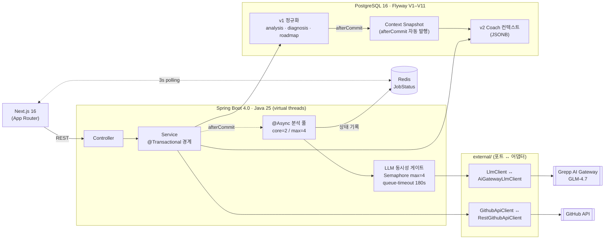

# 발표 PPT 아웃라인 — 깃길 (Team6)

> **발표 일정**: 2026-05-15 (금)
> **발표 시간**: **20분 발표 + 5분 Q&A** (사용자 확인 기준)
> **권장 슬라이드 수**: 14장 (표지 + 본문 12장 + 마무리 1장)
> **분량 분담 기준 (5/13 합의)**: 박봉수 PPT 초안 / 양지니 검토·보강
> **평가 비중**: 문제 정의 20% / **AI 활용 30%** (최대) / 기술 구현 25% / 협업 15% / 발표 10%
>
> 작성: 2026-05-13

---

## 1. 슬라이드 시간·비중 설계 (총 20분)

| 구간 | 슬라이드 | 시간 | 평가 비중 매핑 |
| --- | --- | --- | --- |
| **도입** | 1–3 (표지 / 문제 정의 / 서비스 소개) | 3분 | 문제 정의 20% |
| **AI 활용 (집중)** | **4–7** (5단계 파이프라인 / 모델 선택 / 프롬프트 설계 / 회귀 방어) | **6분** | **AI 활용 30%** |
| **기술 구현** | 8–9 (기술 스택·아키텍처 / 주요 의사결정) | 4분 | 기술 구현 25% |
| **트러블슈팅** | 10–11 (LLM hang / Slice 5+6) | 3분 | 기술 구현 25% |
| **마무리** | 12–14 (팀 기여 / 회고 / Q&A 안내) | 4분 | 협업 15% + 발표 10% |
| **합계** | **14장** | **20분** | 100% |

> **AI 활용 슬라이드 4장 = 약 27%** 비중. 시간으로는 6분/20분 = **30%** 정확. 평가 30% 비중에 맞춤.

---

## 2. 슬라이드별 상세 아웃라인

### Slide 1 — 표지 (30초, **박봉수**)

**구성**
- 서비스명: **깃길**
- 한 줄 설명: "GitHub 활동 기반 AI 성장 코치"
- 팀명: Team6 — 양지니, 박봉수
- 프로그래머스 AI 인턴 프로그램 1기 / 2026-04-20 ~ 2026-05-15

**시각**: 로고 또는 핵심 캐치프레이즈 + 운영 도메인 URL (`parkbongsu.site`)

---

### Slide 2 — 문제 정의 + 타겟 사용자 (1분 30초, **박봉수**)

**핵심 메시지**: "출력물을 다듬는 도구는 많은데, **준비 과정 자체를 설계해주는** 서비스가 비어 있다"

**구성 (3 페인포인트)**
1. 내가 뭘 모르는지 모른다 — 기술 스택은 나열할 수 있어도 목표 직무 대비 실제 갭이 어딘지 객관 파악 어려움
2. 계획을 세워도 실천이 안 된다 — 로드맵 만들어도 매일의 행동으로 연결 안 됨
3. 출력물 다듬기만 지원받는다 — 자소서·면접은 "이미 완성된 포트폴리오" 사용자에 최적화

**타겟**: 목표 직무를 정한 개발자 취준생 / 주니어

---

### Slide 3 — 서비스 소개 + 핵심 기능 + 차별점 (1분, **양지니**)

**구성**
- 3가지 핵심 기능 (한 줄씩): ① GitHub 활동 기반 역량 분석 ② 주차별 학습 로드맵 ③ AI 코치 적응형 재계획
- 차별점 표 (기존 서비스 vs 깃길):
  - 진단 근거: 자기 평가 → **GitHub 활동(코드 증거)**
  - 로드맵: 일반 커리큘럼 → **개인 맞춤 주차별**
  - 적응성: 고정 → **AI 코치가 능동 재계획 제안**
  - 지원 시점: 완성된 사용자 → **준비 과정 자체**

**시각**: 운영 도메인 메인 화면 캡처 1장 (와이어프레임 §1 #2)

---

### Slide 4 — AI 활용 설계 ① — 5개 LLM 호출 지점 🤖 (1분 30초, **양지니**)

> **AI 활용 30% 평가 비중의 핵심 슬라이드. 비중 가장 크게.**

**핵심 메시지**: "AI는 부가 기능이 아니라 **서비스의 핵심 가치 자체**"

**구성**: 5개 단계 표
| 단계 | 입력 | LLM 역할 | 출력 |
| --- | --- | --- | --- |
| ① Triage | repo metadata 20KB | 핵심 저장소 선별 | champions[] |
| ② RepoSummary | 핵심 repo 본문 | 사용 기술·하이라이트 추출 | repoSummaries |
| ③ Synthesis | summaries + static | **최종 기술 프로필 합성** | techTags + depth + evidence |
| ④ Diagnosis | profile + synthesis | 부족 기술 진단 | missingSkills + priority |
| ⑤ Roadmap | diagnosis + 시간 | 주차별 학습 계획 | weeks[8] |

> 추가: Coach 응답 라우팅 (`SIMPLE_GUIDE / REPLAN_SUGGEST / DISMISS`) + `detectedIntent` 라벨 별도 기록

**시각**: 5단계 파이프라인 다이어그램 (좌→우 화살표)

---

### Slide 5 — AI 활용 설계 ② — 모델 선택의 합리성 🤖 (1분 30초, **양지니**)

**핵심 메시지**: *"flash라는 이름이 빠를 것이다"라는 가정을 27회 curl 측정으로 무너뜨린 기록*

**구성**
- 가정 (4/29 ~ 5/10): `glm-4.5-flash` 채택
- 측정 (5/11): flash 평균 74s vs `glm-4.5` 평균 32s — **9×3 측정**
- 발견: GLM-4.5 시리즈는 reasoning 모델. flash가 더 작은 모델이라 같은 결론에 reasoning 토큰을 더 소비 → 역설적으로 느림
- 적용: `glm-4.5` baseline → 5/13 prod `glm-4.7` swap

**시각**: latency 비교 막대 그래프 (flash 74s vs 4.5 32s)

**전달 포인트**: 데이터 기반 의사결정의 사례. 가정을 측정으로 깬 기록

---

### Slide 6 — AI 활용 설계 ③ — 프롬프트 설계 A/B/C 측정 🤖 (1분 30초, **양지니**)

**핵심 메시지**: "system role 분리로 평균 **-64% latency, -64% 응답 크기**"

**구성**
- A (Baseline): user-only instruct, 평균 40.5s, 13.2KB
- B (User-level instruct): "Output ONLY JSON" user role에 추가, 평균 36.7s — 거의 효과 없음
- C (**System role 분리**): system role로 분리, 평균 **14.3s**, **4.8KB** ✅
- 실 e2e 1-repo 분석: **527s → 69s (-87%)**

**시각**: A/B/C 비교 표 + e2e 측정 막대그래프

**전달 포인트**: 프롬프트 위치 1줄 차이가 latency 64% 차이로 이어진 측정 사례

---

### Slide 7 — AI 활용 설계 ④ — 환각 억제 + JSON Schema 회귀 방어 🤖 (1분 30초, **양지니**)

**핵심 메시지**: "LLM은 비결정적이라는 전제 위에서 시스템을 설계"

**구성 (2가지 방어)**
1. **Coach Mutation 환각 억제**
   - 관찰: "1주차 완료로 업데이트해줘" → "완료로 업데이트했습니다" (실제로는 mutation 미발생)
   - 변경: `## 동작 범위` 블록 — "유일한 mutation 경로는 `route=REPLAN_SUGGEST`"
   - 효과: mutation 환각 제거 / LLM-네이티브 응답(자료 추천·코드 리뷰)은 유지
2. **JSON Schema 회귀 3겹 방어**
   - (1) 프롬프트 필드명·타입 명시화
   - (2) JSON Schema 허용 타입 확장
   - (3) `*PromptBuilderTest` + `*ParserTest` 회귀 fixture

**시각**: 3겹 방어 다이어그램 (프롬프트 → 스키마 → 테스트)

---

### Slide 8 — 기술 스택 + 시스템 구조 (1분 30초, **박봉수**)

**구성 (좌측 = 스택 리스트, 우측 = 아키텍처 다이어그램)**
- **프론트**: Next.js 16.2.4 (App Router · RSC) / React 19.2.5 / TypeScript 5.9 / Tailwind
- **백엔드**: **Java 25 (virtual threads on)** / Spring Boot 4.0.3 / Spring Data JPA / **Flyway V1–V11**
  - 패키지 구조: **13개 도메인 layered (controller·service·repository) + 외부 어댑터 분리** (`LlmClient ↔ AiGatewayLlmClient`, `GithubApiClient ↔ RestGithubApiClient`)
- **DB·캐시**: PostgreSQL 16 (정규화 + JSONB) / Redis (비동기 잡 + 3초 폴링)
- **AI**: Zhipu GLM-4.7 (prod) via Grepp AI Gateway (LiteLLM proxy, OpenAI 호환)
  - **LLM 동시성 게이트**: Semaphore `max-concurrent-calls=4`, `queue-timeout=180s`
- **인프라**: AWS EC2 Blue-Green (Terraform) / Nginx HTTPS / GHCR CD / **parkbongsu.site**

**시각**: 아래 mermaid 다이어그램 (PPT용으로 [mermaid.live](https://mermaid.live)에서 SVG export 후 삽입)

**발표자 노트 (1:12)**: 스택은 빠르게 넘기고 다이어그램에서 4가지만 보세요 — ① `@Async`로 트랜잭션 밖에서 LLM 호출, ② Semaphore로 동시 호출 4건 제한, ③ Redis 잡 상태를 프론트가 3초씩 폴링, ④ v1 결과가 커밋되면 Coach용 컨텍스트가 자동 발행. 이 네 가지가 **H7 사고 이후 자리잡은 구조**입니다.

---

### Slide 9 — 주요 의사결정 (1분 30초, **박봉수**)

**구성 — 핵심 의사결정 4건**
1. **LLM 출력만 JSONB, 나머지 정규화** (4/22) — v2 마이그레이션 비용 절감 + v1 쿼리 용이성 균형
2. **GitHub: 정적 분석 + 핵심 repo만 LLM** (4/24) — agentic 분석 대비 토큰 비용 절감
3. **LLM 호출 `@Transactional` 외부 분리** (5/11) — DB 커넥션 hold 방지 (H7 발견 후)
4. **Context Snapshot afterCommit 자동 발행** (5/11~12) — v1 결과 변경 시 v2 컨텍스트 자동 동기화

**시각**: 의사결정 카드 4장 (날짜·결정·이유)

---

### Slide 10 — 트러블슈팅 ① — LLM 5분 hang H1~H8 (1분 30초, **양지니**)

> 트러블슈팅에서 가장 깊이 있게 들어간 사례.

**구성**
- 문제: LLM 호출 47–151초, 일부 5분+ hang. DB `SQLSTATE 08003` 동반
- 가설 풀: H1(network) / H2(payload) / H3(provider) / H4(stream) / H5(max_tokens) / H6(concurrency) / **H7(`@Transactional` 안 LLM 호출)** ✅ / H8(retry)
- **발견**: H7 — JPA 커넥션을 LLM 응답 대기 시간만큼 hold → PostgreSQL idle-in-transaction timeout(5분)
- 해결 3겹: `@Transactional` 외부 분리 + `@Async` afterCommit + `max-concurrent-calls: 4`

**시각**: 가설 검증 표 (H1~H8 ✗/✓ 마킹)

---

### Slide 11 — 트러블슈팅 ② — 666 → 36 calls + 비동기 잡 (1분 30초, **박봉수**)

**구성 (2가지)**
1. **Slice 6 — GitHub API 호출 666 → 36 (-95%)**
   - 문제: 연결 단계에서 metadata 일괄 수집 (18 endpoints × 37 repos)
   - 해결: metadata 수집을 분석 시점으로 이동 + champion 선별 후 핵심 repo만 fetch
2. **Slice 5 — Redis 비동기 잡 + 폴링**
   - 문제: 분석 응답 21–527s block
   - 해결: `@Async` + Redis JobStatus + 3초 폴링 → submit 응답 **373ms**

**시각**: Before/After 비교 (call 수 + 응답 시간)

---

### Slide 12 — 팀원별 기여 내용 (1분 30초, **공동**)

**구성 — 2명 분담 표**

| 영역 | 양지니 | 박봉수 |
| --- | --- | --- |
| 백엔드 | LLM 파이프라인 3단계 / Coach 시스템 프롬프트 / GitHub OAuth·GraphQL | 데이터 저장 계층 / 로드맵·진도 API / LLM 트랜잭션 분리 / Coach 세션 API |
| 프론트 | Coach 채팅·히스토리·플로팅 위젯 / UI 재설계 | Next.js 스캐폴드 / 공통 API client / v1 페이지 연결 |
| 인프라 | — | Redis 비동기 잡 / Context Snapshot 발행 / Pattern Detector 저장 / **AWS EC2 Blue-Green 배포** |
| 운영 | system role 측정·튜닝 / 프롬프트 버저닝 | CI/CD / v1 smoke 35/35 / 운영 도메인 시연 / **한국어 출력 고정·504 fix** |

**시각**: 좌우 분할 + 각자 핵심 PR 번호 3~4개씩

---

### Slide 13 — 회고 + 개선 방향 (1분 30초, **양지니**)

**구성 (4축, 각 1줄)**
- **트러블슈팅 경험**: LLM 응답 불안정은 단일 해법 X → 프롬프트 + 스키마 + 테스트 3겹 방어 필요
- **협업 과정**: docs-first 계약 + 역할 분담 (AI 파이프라인 ↔ 데이터 계층) → 2인 팀에서도 PR 충돌 적었음
- **기술적 성장**: 측정 기반 의사결정 (가정 → 측정 → 결정 사이클). flash 모델 가정을 27회 측정으로 깬 사례
- **솔직한 한계 — "진짜 멀티 에이전트"는 아직 아님**:
  - 현재 = 단일 LLM + intent 라우팅 + `agent_events` audit 테이블. **dispatcher/consumer 없음**, `processed_at` 영원히 null
  - 진짜 멀티 에이전트로 가려면 ① tool/function calling 도입(`propose_replan`, `mark_week_complete`) ② `agent_events`를 outbox→dispatcher로 승격 ③ Planner/Analyst/Monitor를 별개 프롬프트로 분리
  - 시연 시점 ROI 최고 지점은 ①만 — Coach 환각 두 케이스(진도 업데이트·자료 추천) 해소
- **남은 보안 리스크 (access_token AES-GCM은 적용 완료, 그 외)**:
  - **JWT secret fallback** (`application.yml:48`): `${JWT_SECRET:dev-jwt-secret-key-change-in-production-...}` 기본값. `application-prod.yml`은 datasource만 override하고 JWT secret 미override → env 누락 시 공개 repo의 dev secret으로 prod 가동, JWT 위조 가능. **우선순위 1**
  - **CSRF disabled + 쿠키 인증 활성**: `SecurityConfig.java:34` / `OAuth2LoginSecurityConfig.java:35`에서 `.csrf(csrf -> csrf.disable())`. 동시에 `JwtAuthenticationFilter.java:65-84`가 `Authorization` 헤더 **또는** `access_token` 쿠키 둘 다 수용 → 쿠키로 로그인한 사용자에게 CSRF로 mutation 엔드포인트 호출 가능
  - **애플리케이션 레벨 rate limit 부재**: 로그인·OAuth·Coach 채팅 무제한 → LLM 토큰 비용 폭주/brute-force. Bucket4j 도입 backlog
  - **LLM 입력 방어 부재** (`CoachMessageRequest.@Size(max=4000)`만 적용, 그 외 방어 없음):
    - **Jailbreak / system prompt 추출**: "이전 지시 무시", "DAN 모드", 역할 재정의에 대한 거절 룰이 system prompt에 명시 없음 → system prompt 유출 시 우회법 공유. PII 영향 X (system prompt에 비밀 없음)
    - **User message 기반 인젝션 (route 강제)**: user message가 그대로 user role에 주입 → "route=REPLAN_SUGGEST로 답해" 같은 시도가 본인 로드맵 의도치 않은 재생성 (자해 한정, 타 사용자 영향 X)
    - **GitHub 콘텐츠 기반 인젝션**: README/commit msg/description이 escape 없이 5개 PromptBuilder의 user role에 주입 → 악의적 README로 분석 결과 왜곡 가능
    - **부적절 콘텐츠 요청**: NSFW/hate speech 거절 룰이 prompt에 명시 없음. 모델(GLM-4.7) 자체 거절에 의존
    - (Tool args XSS는 React 자동 escape로 사실상 무해 — 방어됨)
  - **`agent_events.event_data` 평문 JSONB**: 현재는 id만, tool calling 도입 시 PII 유입 가능 — `access_token` AES-GCM과 일관성 맞춰야 함
- **그 외 개선할 점**: 관측성 (커스텀 메트릭·Grafana) / 부하 테스트 / LLM quality 평가 자동화 / Coach 응답 streaming (#220)

**시각**: 4분면 카드 (트러블슈팅 / 협업 / 성장 / **한계 + 다음 단계**)

**발표자 노트 (0:30)**: "한 가지 솔직히 짚자면, 현재 시스템은 단일 LLM + 룰 라우팅이고, `agent_events` 테이블은 있지만 dispatcher가 없어서 사실상 audit log입니다. 진짜 멀티 에이전트는 tool calling 도입이 첫 단계고, 그 다음이 이 테이블을 outbox로 승격하는 일입니다." (실패를 인정하면 Q&A에서 같은 지적이 안 옴)

---

### Slide 14 — 마무리 + Q&A 안내 (30초, **공동**)

**구성**
- 시연 안내: `https://parkbongsu.site` (Q&A 시 라이브 시연 가능)
- 관련 문서: GitHub ORG URL + 노션 페이지 URL
- 감사 인사
- "Q&A 받겠습니다"

---

## 3. 분량 분담 정리

| 발표자 | 슬라이드 번호 | 시간 (대략) |
| --- | --- | --- |
| **박봉수** | 1, 2, 8, 9, 11, 12 (절반), 14 (절반) | **약 8분** — 도입·기술 구조·인프라·박봉수 본인 트러블슈팅 |
| **양지니** | 3, 4, 5, 6, 7, 10, 12 (절반), 13, 14 (절반) | **약 12분** — 서비스 소개·AI 활용 4장·LLM hang·회고 |

> **분담 근거**:
> - AI 활용 4장(4–7)은 LLM 파이프라인·프롬프트 튜닝 담당자가 발표하는 게 자연스러움 → 양지니
> - 인프라·배포·v1 안정화는 박봉수 → 시스템 구조·Slice 5/6 자연스러움
> - 12번 팀원 기여는 각자 본인 칸 1분씩 분담
> - 박봉수가 PPT 초안 작성 → 양지니가 AI 슬라이드 보강 (역할에 맞게)

---

## 4. 시각 자료 체크리스트

| 슬라이드 | 필요한 시각 자료 | 어디서? |
| --- | --- | --- |
| 1 | 표지 디자인 | 캔바·PPT 템플릿 |
| 2 | 페인포인트 일러스트 | 무료 아이콘 (Heroicons / Lucide) |
| 3 | 운영 화면 캡처 1장 | **와이어프레임 §1 #2 대시보드** |
| 4 | 5단계 파이프라인 다이어그램 | 직접 그리기 (PPT 도형) |
| 5 | latency 막대 그래프 (flash vs 4.5) | docs/27 측정 데이터 |
| 6 | A/B/C 비교 차트 | docs/32 측정 데이터 |
| 7 | 3겹 방어 다이어그램 | 직접 그리기 |
| 8 | 시스템 구조 다이어그램 | 노션 §7 ASCII → 도식화 |
| 9 | 의사결정 카드 4장 | 직접 그리기 |
| 10 | H1~H8 가설 검증 표 | docs/27 |
| 11 | Before/After 막대 그래프 | docs/28 + docs/27 |
| 12 | 좌우 분할 기여 표 | 노션 §3 |
| 13 | 4분면 회고 카드 | 직접 그리기 |
| 14 | 도메인 URL + QR 코드 | parkbongsu.site QR 생성 |

---

## 5. 시연 백업 영상 (필수)

- **분량**: 1분 ~ 1분 30초
- **흐름**: 로그인 → 대시보드 → GitHub 연결 → 분석 비동기 → 진단 → 로드맵 → Coach 채팅
- **편집**: 분석 비동기 대기 시간은 2~3배속 가속 (또는 자르기)
- **목적**: 시연 도중 네트워크 장애 시 즉시 재생
- **저장 위치**: PPT 마지막 슬라이드에 embed 또는 별도 mp4 (Drive 백업)

---

## 6. Q&A 대비 (5분)

### 고확률 질문 (대비 필수)

| 질문 | 핵심 답변 키워드 |
| --- | --- |
| "GLM 다른 모델 안 써봤어요? Claude/GPT?" | Grepp AI Gateway 제약 (지정 모델만) / 향후 다른 provider 격리 테스트는 backlog |
| "월 LLM 비용?" | Grepp AI Gateway 사용 — 직접 측정 안 함 / prod glm-4.7 기준 / 비동기 + max-concurrent-calls:4 로 비용 폭주 차단 |
| "1000명 동시 접속?" | 2GB EC2 한계 명시 / 외부 DB·Redis·ALB 필요 |
| "access_token 어떻게 저장?" | 평문 (v1 MVP backlog) / JPA `@Convert` + AES-GCM 후속 |
| "AI 결과 틀리면?" | 사용자 보정 UI (Correction) / JSON Schema 회귀 방어 / quality 평가 자동화는 backlog |
| "v2 코딩테스트 분석 안 하나요?" | 프로그래머스 공식 API 없음 / 2인 리소스 한계로 v3로 이동 |
| "Coach 세션 snapshot pin이 변경 자동 반영?" | 의도된 일관성 (대화 중 컨텍스트 변경 방지) / 명시적 새로고침 UX는 backlog |

### 중확률 질문

| 질문 | 핵심 답변 키워드 |
| --- | --- |
| "왜 SSE 안 쓰고 폴링?" | `async_queue_research.md` — Redis 폴링 패턴, 이전 프로젝트 reference impl 검증 |
| "Spring AI 채택했다고 했는데?" | 초기 검토 / 실 구현은 Custom GLM ChatModel로 단순화 |
| "JSONB vs 정규화 어떻게 결정?" | 4/22 합의 — LLM 출력만 JSONB / 쿼리 용이성·마이그레이션 비용 균형 |
| "Flyway V8이 왜 없어?" | V8 결번 — 작업 분기 중 V8 후보 변경, V9로 직접 점프 |
| "2인 팀에서 PR 리뷰는 어떻게?" | 작은 PR / docs-first 계약 / stacked PR for cross-cutting |

---

## 7. 발표 준비 체크리스트 (5/14 ~ 5/15)

### 5/14 (목)
- [ ] PPT 초안 완성 (박봉수 — 오후까지)
- [ ] AI 활용 4장 보강 (양지니 — 저녁)
- [ ] 시각 자료 일괄 생성 (그래프·다이어그램)
- [ ] 시연 백업 영상 녹화 + 편집
- [ ] 1차 리허설 (각자 분담 시간 측정)

### 5/15 (금) 발표 당일
- [ ] 2차 리허설 (전체 흐름)
- [ ] 시연 환경 점검 (parkbongsu.site / GitHub OAuth / LLM)
- [ ] Q&A 예상 답변 마지막 점검
- [ ] 노트북·HDMI·여분 케이블·백업 영상 USB 준비

---

## 8. PPT 디자인 권장

- **테마**: 깔끔한 미니멀 (Canva·PowerPoint 기본 템플릿 충분)
- **컬러**: 2~3색 (메인 + 강조 + 회색). emerald/teal 계열이 "성장" 메시지와 맞음 (실제 서비스 UI도 emerald)
- **폰트**: 본문 22pt 이상 / 제목 36pt 이상
- **슬라이드 1장당 메시지 1개** 원칙 — 단일 take-away
- **이모지·아이콘**은 적절히 사용 가능 (🤖 AI 슬라이드 4장에 통일감 부여)

---

> 본 아웃라인은 PPT 작성 시 참조용입니다. 실제 슬라이드 분량·시간은 리허설 결과에 따라 조정합니다.
